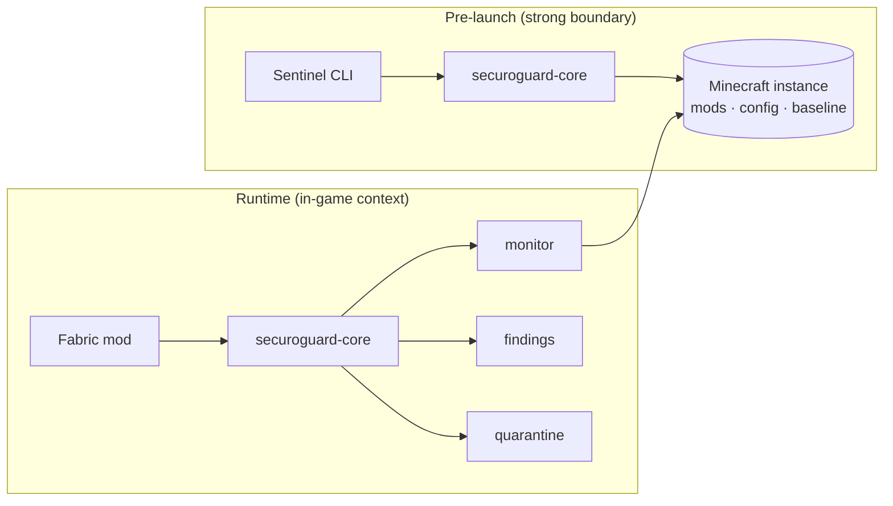

<p align="center">
  
</p>

<h1 align="center">SecuroGuard</h1>

<p align="center">
  A free, open-source security monitor for Minecraft mod instances.
</p>

<p align="center">
  <a href="https://github.com/JohnCDupe/SecuroGuard/actions/workflows/ci.yml"></a>
  <a href="https://github.com/JohnCDupe/SecuroGuard/blob/main/LICENSE"></a>
</p>

SecuroGuard watches a Minecraft instance for a specific, real threat: **a malicious
JAR being written into your `mods` folder and set to run the next time the game
launches.** This is exactly the pattern behind the 2026 Litematica/Servux
arbitrary-file-write issue, where a server could exploit a vulnerable mod to drop a
JAR into `mods`. SecuroGuard detects that change, explains it in plain language,
preserves the evidence, and lets you quarantine the file safely — **without ever
running it.**

> [!IMPORTANT]
> **SecuroGuard is a Minecraft integrity monitor, not a general antivirus.** It does
> not scan your whole computer, and it **cannot** reliably contain code that is
> already running inside the Minecraft JVM. Its external **Sentinel** tool is the
> stronger boundary because it inspects your instance *before* the game (and any mod)
> starts. See [Limitations](#limitations--threat-model).

> [!NOTE]
> **Status: pre-release (`0.1.0-SNAPSHOT`).** Automated builds and tests pass on
> Ubuntu and Windows, but no release candidate has been published yet. See
> [Project status](#project-status).

---

## Features

- **Pre-launch scanning** with the external Sentinel — the strong boundary, before
  any mod runs.
- **Runtime monitoring** with the Fabric mod — detects files added or changed in
  `mods` during a play session and warns you immediately.
- **Trusted baseline** — you approve a known-good set of files; anything new or
  changed is flagged against it.
- **Metadata-only JAR inspection** — never loads a class or runs an entry point;
  bounded against zip bombs and malformed archives.
- **Known-vulnerability advisories** — matches installed mods against a bundled,
  signed-verifiable advisory feed (includes the Litematica/Servux issue).
- **Safe, opt-in quarantine** — moves a suspect file out of `mods` with verification
  and a full audit trail; restore is containment-checked. Nothing is ever deleted
  automatically.
- **Privacy-respecting and offline-first** — no telemetry, no accounts, no uploads
  of your files.

## How it works

SecuroGuard has three parts that share one engine:

1. **The engine (`securoguard-core`)** hashes the files in your instance (SHA-256),
   compares them to a baseline you approved, inspects changed JARs' metadata, checks
   installed mods against the advisory feed, and turns anything notable into a
   structured **finding** (INFO → CRITICAL).
2. **The Sentinel** runs the engine from a normal command line *before* Minecraft
   starts. Because no mod is running yet, a malicious JAR is just inert bytes on
   disk — the Sentinel can inspect and quarantine it with no chance for it to
   execute. A launcher can even block launch on its exit code.
3. **The Fabric mod** runs the engine *inside* the game to add live context: it
   knows when a session is active and watches `mods` in real time, so a JAR that
   appears mid-session is flagged at once.



## Quick start (no programming needed)

The fastest way to protect yourself is the **pre-launch Sentinel**:

1. Download the Sentinel distribution (`securoguard-*.zip`) — or build it (see
   [Building from source](#building-from-source)).
2. Unzip it and open a terminal in the `bin` folder.
3. From a **known-good** state (ideally right after a clean install), approve a
   baseline:
   ```
   securoguard approve --game-dir "C:\path\to\your\instance" --scope prelaunch --yes
   ```
4. Before each play session, scan:
   ```
   securoguard scan --game-dir "C:\path\to\your\instance" --mc-version 1.21.11
   ```
   - Exit code `0` means SecuroGuard found no MEDIUM-or-higher blocking findings
     in that scan. It is **not** a guarantee that the instance is safe. `1` =
     warnings (MEDIUM/HIGH); `2` = a CRITICAL finding.
5. If something is flagged and you did not install it, quarantine it (it is moved
   aside, not deleted):
   ```
   securoguard quarantine --game-dir "C:\path\to\your\instance" --file "C:\...\mods\suspicious.jar"
   ```

Prefer the in-game experience? Install the **Fabric mod** as well — see below.

## Installation

### Fabric mod (runtime monitoring)

1. Install **Fabric Loader** and the **Fabric API** for Minecraft 1.21.11.
2. Copy the SecuroGuard mod jar (`securoguard-*.jar`, **not** the `-sources` jar)
   into your instance's `mods` folder.
3. (Optional) Install **Mod Menu** to get a configuration/status screen.
4. Launch the game. SecuroGuard runs an initial comparison and starts monitoring.

In-game commands (local only — never sent to the server):

```
/securoguard status     # monitoring state, baseline state, finding count
/securoguard scan       # re-scan now
/securoguard findings    # list current findings
```

### Sentinel (pre-launch scanner)

Download the Sentinel `securoguard-*.zip` (or `.tar`), unzip, and run `bin/securoguard`
(`bin/securoguard.bat` on Windows). Commands:

```
securoguard status     --game-dir <path>
securoguard approve    --game-dir <path> [--scope prelaunch] --yes
securoguard scan       --game-dir <path> [--scope prelaunch] [--mc-version 1.21.11] [--redact]
securoguard quarantine --game-dir <path> --file <path>
securoguard restore    --game-dir <path> --item <id> --yes
securoguard watch      --game-dir <path> [--min-severity high] [--mc-version 1.21.11]
```

Pass `--mc-version` so advisory matching is precise; without it the Sentinel warns
and skips coordinate advisory matching rather than guessing. `approve` and `scan`
should use the same `--scope`.

#### Prism Launcher pre-launch integration

Prism Launcher supports a custom **pre-launch command** (Edit Instance → Settings →
Custom commands). Point it at the Sentinel, e.g.:

```
/path/to/securoguard scan --game-dir "$INST_MC_DIR" --mc-version 1.21.11
```

A non-zero exit indicates findings. **Note:** this has not been tested against a live
Prism install; verify the variable name and blocking behavior in your Prism version.

## Supported versions

Selected from the official Fabric metadata APIs; see [docs/architecture.md](docs/architecture.md).

| Component | Version |
|---|---|
| Java | 21 (Temurin) |
| Minecraft | 1.21.11 |
| Fabric Loader | 0.19.3 |
| Fabric API | 0.141.4+1.21.11 |
| Fabric Loom | 1.17.14 |
| Gradle | 9.6.1 |
| Mod Menu (optional) | 17.0.0 |

## Establishing your baseline safely

Some of SecuroGuard's checks compare against a baseline you approved, and some do
not:

- **Baseline-dependent (change detection):** "new JAR", "changed", "removed", and
  "replaced" findings all measure a file against the approved baseline. On a fresh
  install there is no baseline, so nothing is called "new" until you approve one.
- **Baseline-independent (always run):** known-malicious hash matches, advisory
  matching against known-vulnerable mod versions, misleading double-extension
  filenames, and archive-structure checks (path traversal, malformed/zip-bomb
  archives) are evaluated on every scan regardless of whether a baseline exists.

So a baseline sharpens change detection, but SecuroGuard is not silent without one.
Approve a baseline from a state you trust:

- **Pre-launch (recommended):** `securoguard approve --game-dir <path> --scope prelaunch --yes`,
  ideally right after a clean install and offline.
- The Fabric mod uses a separate **runtime** baseline; approve it with
  `--scope runtime` or rely on the Sentinel for the stronger boundary.

Approving is the **only** action that grants trust. Dismissing a warning in the UI
hides it but never trusts the file.

## Example findings and exit codes

A finding is structured and self-explanatory, for example:

```
[HIGH] SG-ADVISORY — Known-vulnerable mod: litematica 0.26.10
    path: mods/litematica.jar
    evidence: advisory=SG-ADV-2026-07-LITEMATICA-1.21.11 installedVersion=0.26.10 fixed=0.26.11
    recommended: UPDATE
```

Sentinel exit codes (a stable contract for launcher integration):

| Code | Meaning |
|---|---|
| 0 | No MEDIUM-or-higher blocking findings in this scan (not a guarantee of safety) |
| 1 | Warnings (MEDIUM/HIGH) |
| 2 | CRITICAL finding present |
| 3 | Configuration error |
| 4 | Internal error |

Exit code `0` reports only what this scan checked; it does not certify the instance
as clean. Treat SecuroGuard as one layer, not a guarantee.

## Privacy behavior

- **No telemetry, no accounts, no uploads of your files.** Ever.
- Optional online reputation (Modrinth) is **off by default**, **hash-only**, and
  fails open — a network problem never blocks the game or a scan.
- Server addresses are **not** stored or transmitted; the mod keeps only a boolean
  "connected to multiplayer" and treats single-player separately.
- SecuroGuard does not intentionally search for or parse credentials, tokens, or
  launcher account data. Files inside a selected scan scope may be read for hashing,
  and their paths or metadata may appear in local findings or logs. File contents are
  not uploaded. (Choose your scan scope accordingly — the default runtime scope
  covers `mods`, not `saves` or account files.)
- Logs stay under `<instance>/securoguard/logs`, are size-bounded, and scrub line
  breaks. Reports support `--redact` to hide absolute/home paths.

## Limitations & threat model

- **Same-JVM limit (by design):** the Fabric mod and any hostile mod run in the same
  JVM with equal privileges, so the mod cannot reliably contain code that is already
  executing. The **Sentinel is the stronger, pre-launch boundary.**
- **"Unknown" is not "malicious."** Unknown files (private packs, dev builds, new
  mods) are reported as INFO, never as threats.
- SecuroGuard makes **no claim of guaranteed detection**. It raises the cost of the
  specific threats it targets; it is not a substitute for good sourcing of mods.
- A documented residual symlink/junction time-of-check/time-of-use window exists for
  restore. See the full [threat model](docs/threat-model.md).

## Building from source

Requires JDK 21 (the build uses Gradle toolchains). Use the bundled wrapper — no
separate Gradle install needed.

```bash
./gradlew build                      # compile, run all tests, assemble artifacts
./gradlew :securoguard-fabric:remapJar    # the production Fabric mod jar
./gradlew :securoguard-sentinel:installDist   # a runnable Sentinel install
./gradlew verifyReleaseArtifacts releaseChecksums   # verify + checksum the release artifacts
```

Windows: use `gradlew.bat`.

## Verifying checksums

Release builds produce `SHA256SUMS.txt` plus a `.sha256` next to each artifact:

```bash
sha256sum -c SHA256SUMS.txt      # Linux/macOS
```

On Windows, compare `Get-FileHash <file> -Algorithm SHA256` against the published
value. A checksum verifies **file integrity** (the download matches this list); it
does not by itself prove publisher authenticity.

## Contributing

Contributions are welcome — see [CONTRIBUTING.md](CONTRIBUTING.md) and our
[Code of Conduct](CODE_OF_CONDUCT.md). Please add tests for behavioral changes and do
not weaken the security protections.

## Reporting a vulnerability

Please report vulnerabilities **privately** — see [SECURITY.md](SECURITY.md). Use
GitHub's private vulnerability reporting.

> [!WARNING]
> **Never upload live malware, access tokens, `launcher_accounts.json`, credential
> files, or private world/user files to GitHub issues or pull requests.** Share
> hashes and redacted output instead. The Sentinel's `--redact` flag helps.

## License

Licensed under the [Apache License 2.0](LICENSE). See [NOTICE](NOTICE) and
[THIRD_PARTY_NOTICES.md](THIRD_PARTY_NOTICES.md) for attribution of components
distributed with, or required at runtime by, SecuroGuard.

## Project status

This is a pre-release project (`0.1.0-SNAPSHOT`). The canonical source repository is
[JohnCDupe/SecuroGuard](https://github.com/JohnCDupe/SecuroGuard). Live CI validation
passes on Ubuntu and Windows. Before the first release candidate, the manual in-game
and Prism checklist in [docs/demo.md](docs/demo.md) still needs to be completed.

The version stays at `0.1.0-SNAPSHOT` until a tagged release is cut.

## Repository layout

```
securoguard/
  securoguard-core/       engine: instance, inventory, baseline, monitor,
                          jar, findings, quarantine, advisory, reputation, service
  securoguard-sentinel/   external command-line scanner
  securoguard-fabric/     client-side Fabric mod
  docs/                   architecture, threat model, advisory format, demo/checklist
  sample-config/          example securoguard.json
```
